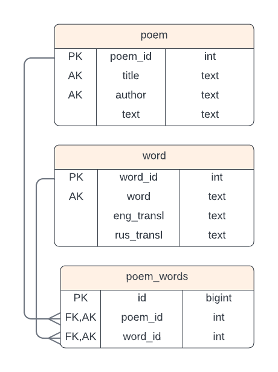

# Kabardian Poetry ETL

## The Goal of This Project

This repository contains an Extract, Transform, Load (ETL) project that utilizes PostgreSQL and a Python script.

- The main goal of this project is to populate the [Kabardian Poetry Collection](https://kabardian-poems-collection-b906b8b63b33.herokuapp.com/) with poems in [Kabardian language](https://en.wikipedia.org/wiki/Kabardian_language) - a [potentially vulnerable](https://en.wal.unesco.org/countries/russian-federation/languages/kabardian)* language spoken in Northwest Caucasus. This poems collection will show each poem on a separate page together with the poem's vocabulary - words that the custom Python script could find in the [kbd.wiktionary.org/wiki/](https://kbd.wiktionary.org/wiki/%D0%9D%D0%B0%D0%BF%D1%8D%D0%BA%D3%80%D1%83%D1%8D%D1%86%D3%80_%D0%BD%D1%8D%D1%85%D1%8A%D1%8B%D1%89%D1%85%D1%8C%D1%8D) dictionary and extract these words' translation.

- The custom script performs the following steps to extract, transform and load data into the local database:
    1. it extracts each poem's content from up to 10 txt files saved in the poems_contents folder;
    2. it checks if the poem is already in the database; the poem will not be added if this is the case;
    3. it then splits each poem into separate words and checks if these words can be found in the online dictionary;
    4. if a word was found, it checks if this word is already in the database and adds it to the words pool if not;
    5. finally, the script allocates the found words and their translation to the corresponding poem which will then appear in the Vocabulary section on each [poem page](https://kabardian-poems-collection-b906b8b63b33.herokuapp.com/poems/1/) underneath the poem.
     
- Once the data is extracted and loaded to the local database, the contents of its tables will be moved to the corresponding tables in the PostgreSQL database. This database hosted on AWS is the one that the [Kabardian Poetry Collection](https://kabardian-poems-collection-b906b8b63b33.herokuapp.com/) site is using to display its poems.

<br>

\* classified by the UNESCO Atlas of the World's Languages in Danger.

## Entity Relationship Diagram for Kabardian Poetry Collection




## Repository Structure

## How It Works

<details>

<summary>Dependency Management With Python Poetry</summary>

### Activating Virtual Environment
Sources: [Real Python](https://realpython.com/dependency-management-python-poetry/), [Poetry Docs](https://python-poetry.org/docs/basic-usage/)

#### 1. Activate Poetry Shell
To activate the virtual environment, create a nested shell with poetry shell. This will activate the environment and start a new shell session within it.

After running this command, you'll be inside the virtual environment, and any Python commands or scripts you run will use the dependencies installed in this environment.
```bash
   poetry shell
```
To deactivate the virtual environment and exit this new shell type exit.
```bash
   exit
```
To deactivate the virtual environment without leaving the shell use deactivate.
```bash
   deactivate
```

#### 2. Directly Use the Virtual Environment (Without Activating the Shell)
If you don’t want to activate the entire shell but just want to run commands within the Poetry-managed virtual environment, you can prefix your commands with poetry run.
```bash
poetry run python insert_data.py
```
Or to run a dbt command:
```bash
poetry run dbt run
```

#### 3. Keep Dependencies Updated
```bash
poetry update
```

</details>

----

<details>
<summary>DBT Installation With Python Poetry</summary>

#### 1. Add dbt-core dbt-postgres to your dependencies
```bash
poetry add dbt-core dbt-postgres
```
Verify installation:

```bash
poetry shell
dbt --version
```
#### 2. Set Up a DBT Project and navigate into this project
```bash
dbt init kabardian_poems
cd kabardian_poems
```
#### 3. Configure profiles.yml file to connect to PostgreSQL
dbt requires a profiles.yml file to connect to your PostgreSQL database. The file is usually located in ~/.dbt/. Configure the file:

```yml
kabardian_poems:
  outputs:
    dev:
      dbname: your_db_name
      host: your_host
      pass: your_password
      port: 5432
      schema: "{{ env_var('DBT_SCHEMA', 'your_dbt_schema') }}"
      threads: 4
      type: postgres
      user: your_user
  target: dev
```

</details>

---- 

## Getting Started


<!-- # Use an official Python runtime as a parent image
FROM python:3.11-slim

# Set the working directory in the container
WORKDIR /app

# Install Poetry, PostgreSQL development libraries, PostgreSQL client utilities, and psycopg2
RUN apt-get update \
    && apt-get install -y libpq-dev gcc postgresql-client \
    && pip install poetry psycopg2

# Copy the pyproject.toml and poetry.lock files
COPY pyproject.toml poetry.lock ./

# Install dependencies via Poetry
RUN poetry config virtualenvs.create false && poetry install --no-interaction --no-ansi

# Copy the current directory contents into the container at /app
COPY . .

# Run the Python script
CMD ["python", "insert_data.py"]

# https://dev.to/ag2byte/connect-your-local-resources-from-inside-your-docker-container-h4k -->